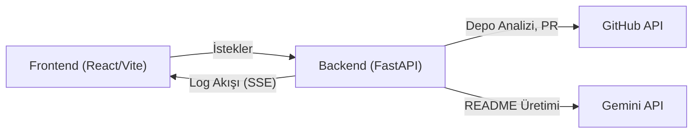

# DerinNLPV2: Otonom GitHub Dokümantasyon Ajanı

Bu proje, bir GitHub deposunun kaynak kodunu analiz ederek yapay zeka destekli profesyonel bir README.md dosyası oluşturan ve bu dosyayı otomatik bir Pull Request (Çekme İsteği) olarak sunan otonom bir dokümantasyon ajanıdır. Hem **FastAPI** ile geliştirilmiş bir arka uca hem de **Vite + React** ile oluşturulmuş sezgisel bir ön uca sahiptir.

## İçindekiler
- [Özet](#özet)
- [Özellikler](#özellikler)
- [Gereksinimler](#gereksinimler)
- [Kurulum ve çalıştırma](#kurulum-ve-çalıştırma)
- [Yapılandırma](#yapılandırma)
- [Kullanılan teknolojiler](#kullanılan-teknolojiler)
- [Mimari ve klasör yapısı](#mimari-ve-klasör-yapısı)
- [API veya uç noktalar](#api-veya-uç-noktalar)
- [Test ve kalite](#test-ve-kalite)
- [Dağıtım ve üretim notları](#dağıtım-ve-üretim-notları)
- [Katkıda bulunma](#katkıda-bulunma)
- [Lisans](#lisans)

## Özet
DerinNLPV2, geliştiricilerin GitHub depoları için profesyonel ve güncel README dosyaları oluşturma sürecini otomatikleştirmeyi hedefler. Bir depo URL'sini alarak, içeriklerini analiz eder, Google'ın Gemini yapay zeka modeliyle kapsamlı bir README taslağı üretir ve bu taslağı doğrudan bir Pull Request olarak ilgili depoya gönderir. Ayrıca, kullanıcının GitHub profilindeki tüm herkese açık depoları listeleyebilir ve var olan README durumlarını gösterebilir, böylece dokümantasyon eksikliği olan projelere odaklanmayı kolaylaştırır. Ön yüz, süreç ilerlemesini canlı olarak gösteren bir konsol çıktısı ve üretilen README'nin önizlemesini sunar.

## Özellikler
- **Otonom README Üretimi:** GitHub depo kodlarını analiz ederek AI (Gemini) destekli README.md dosyaları oluşturur.
- **Otomatik Pull Request (PR) Oluşturma:** Üretilen README'yi doğrudan GitHub deposuna bir PR olarak gönderir.
- **Canlı Log Akışı (SSE):** Ön yüzdeki konsol aracılığıyla arka uçtaki işlemleri gerçek zamanlı olarak izleme imkanı sunar.
- **GitHub Profil Analizi:** Belirtilen bir GitHub kullanıcısının tüm herkese açık depolarını listeler ve her bir depo için README.md dosyasının varlığını belirtir.
- **Sezgisel Web Arayüzü:** Vite ve React ile geliştirilmiş kullanıcı dostu bir ön yüz üzerinden kolay etkileşim sağlar.
- **Mermaid Diyagram Desteği:** Üretilen README içinde bulunan Mermaid diyagramlarını önizlemede görselleştirir.
- **Word (.docx) Dışa Aktarımı:** Üretilen README içeriğini Word belgesi olarak indirme seçeneği sunar.
- **Gelişmiş Yapılandırma:** Çekirdek işlevsellik için gerekli GitHub ve Gemini API anahtarları kolayca yapılandırılabilir.
- **Esnek Talimat Modları:** README üretim sürecine ek kullanıcı talimatları eklenebilir, çıktının tamamını veya belirli bölümlerini hedefleyebilir.
- **Güvenli Ortam Değişkeni Yönetimi:** Hassas API anahtarlarının `.env` dosyası üzerinden güvenli bir şekilde yönetilmesini destekler.
- **Platformlar Arası Çalışma:** Python ve Node.js ekosistemlerinde yaygın araçlar kullanılarak birden fazla işletim sisteminde çalışabilir.
- **Hızlı Geliştirme Ortamı:** Vite ve Tailwind CSS ile hızlı frontend geliştirme ve stil oluşturma imkanı sunar.

## Gereksinimler
Bu projenin başarıyla çalışması için aşağıdaki yazılımların sisteminizde kurulu olması gerekir:

**Çalışma Zamanı Ortamları:**
- **Python:** Sürüm 3.9 veya daha yenisi (Pyright yapılandırmasına göre).
- **Node.js:** Sürüm 18.0.0 veya daha yenisi (Vite ve ESLint gereksinimlerine göre).

**Gerekli Servisler/Hesaplar:**
- **GitHub Hesabı:** Depo erişimi ve Pull Request oluşturma için.
- **GitHub Personal Access Token (PAT):** Gerekli izinlerle yapılandırılmış (`repo` ve `workflow` kapsamları önerilir).
- **Google Gemini API Anahtarı:** README üretimi için.

## Kurulum ve çalıştırma
Proje, hem arka uç (FastAPI) hem de ön uç (React + Vite) bileşenlerini içerir.

1.  **Depoyu klonlayın:**
    ```bash
    git clone https://github.com/DerinNLPV2/DerinNLPV2.git
    cd DerinNLPV2
    ```

2.  **Arka uç (.env) yapılandırması:**
    `backend/.env.example` dosyasını kopyalayarak `backend/.env` adında yeni bir dosya oluşturun ve gerekli API anahtarlarını girin:
    ```bash
    cp backend/.env.example backend/.env
    # backend/.env dosyasını düzenleyin:
    # GITHUB_TOKEN=YOUR_GITHUB_PERSONAL_ACCESS_TOKEN
    # GEMINI_API_KEY=YOUR_GEMINI_API_KEY
    # GEMINI_MODEL=gemini-2.5-flash (isteğe bağlı, varsayılanı kullanmak için boş bırakılabilir)
    # FRONTEND_ORIGINS=http://localhost:5173,http://127.0.0.1:5173 (isteğe bağlı, varsayılanı kullanmak için boş bırakılabilir)
    ```

3.  **Arka uç bağımlılıklarını yükleyin:**
    `backend` dizinine gidin ve Python bağımlılıklarını kurun. `backend/main.py` dosyasındaki içe aktarımlara göre, sanal bir ortam oluşturmak ve gerekli paketleri yüklemek iyi bir uygulamadır:
    ```bash
    cd backend
    python -m venv .venv
    .venv/bin/pip install fastapi uvicorn python-dotenv pygithub google-generativeai pydantic # requirements.txt dosyası depoda bulunamadığından manuel kurulum önerilir.
    cd ..
    ```

4.  **Ön uç bağımlılıklarını yükleyin:**
    `frontend` dizinine gidin ve Node.js bağımlılıklarını kurun:
    ```bash
    cd frontend
    npm install
    cd ..
    ```

5.  **Projenin tamamını çalıştırın (önerilen):**
    Kök dizinde, hem arka ucu hem de ön ucu tek bir komutla başlatmak için `dev.bat` betiğini kullanın:
    ```bash
    dev.bat start
    ```
    Bu komut, varsayılan olarak arka ucu `http://127.0.0.1:8000` adresinde ve ön ucu `http://127.0.0.1:5173` adresinde başlatacaktır.

6.  **Diğer `dev.bat` komutları:**
    -   Durdurma: `dev.bat stop`
    -   Yeniden başlatma: `dev.bat restart`
    -   Durum kontrolü: `dev.bat status`

## Yapılandırma
Projenin temel yapılandırması `backend/.env` dosyası üzerinden yapılır.

| Değişken            | Açıklama                                                                                                                                                                                                                                                                                                                                                      | Zorunlu    |
| :------------------ | :------------------------------------------------------------------------------------------------------------------------------------------------------------------------------------------------------------------------------------------------------------------------------------------------------------------------------------------------------------ | :--------- |
| `GITHUB_TOKEN`      | GitHub API'ye erişmek için kullanılan Personal Access Token. Depo içeriğini okuma ve Pull Request oluşturma (`repo` ve `workflow` kapsamları) yetkisine sahip olmalıdır.                                                                                                                                                                                           | Evet       |
| `GEMINI_API_KEY`    | Google Gemini API'ye erişim için kullanılan anahtar. README içeriklerini oluşturmak için gereklidir.                                                                                                                                                                                                                                                             | Evet       |
| `GEMINI_MODEL_PREF` | Kullanılacak Gemini modeli (ör. `gemini-2.5-flash`, `gemini-flash-latest`). Belirtilmezse, `backend/main.py` içinde tanımlı varsayılan bir yedek sıra kullanılır.                                                                                                                                                                                                | İsteğe bağlı |
| `FRONTEND_ORIGINS`  | CORS (Cross-Origin Resource Sharing) için izin verilen ön uç adresleri listesi (virgülle ayrılmış). Geliştirme ortamında `http://localhost:5173` gibi değerler içerir. Üretim ortamında uygulamanın çalıştığı URL'leri içermelidir.                                                                                                                               | İsteğe bağlı |

## Kullanılan teknolojiler
**Arka Uç (Backend):**
-   **Dil:** Python
-   **Web Çatısı:** FastAPI
-   **GitHub API İstemcisi:** PyGithub
-   **Yapay Zeka Modeli:** Google Generative AI (Gemini)
-   **Ortam Değişkeni Yönetimi:** python-dotenv
-   **Tip Kontrolü:** Pyright

**Ön Uç (Frontend):**
-   **Çerçeve:** React 18.3.1
-   **Derleme Aracı:** Vite 5.4.11
-   **CSS Çerçevesi:** Tailwind CSS 3.4.19
-   **CSS Post-işlem:** PostCSS 8.x, Autoprefixer 10.x
-   **Markdown İşleme:** react-markdown 9.0.1, rehype-raw 7.0.0, remark-gfm 4.0.1, marked 18.0.3
-   **Diyagramlar:** Mermaid 11.14.0
-   **Simgeler:** Lucide React 0.468.0
-   **Kod Kalitesi:** ESLint 9.15.0
-   **Word Belgesi Oluşturma:** docx 9.6.1

## Mimari ve klasör yapısı
Proje, ayrı frontend ve backend dizinleriyle modüler bir yapıya sahiptir. `backend` klasörü bir FastAPI uygulaması barındırırken, `frontend` klasörü bir React uygulamasını Vite ile barındırır. Bu ayrım, her bir bileşenin bağımsız olarak geliştirilmesini, test edilmesini ve dağıtılmasını kolaylaştırır.

Arka uç, GitHub API ile etkileşime girerek depo bilgilerini toplar ve Gemini API ile dokümantasyon metinleri üretir. Ayrıca, ön yüze SSE (Sunucu Tarafından Gönderilen Olaylar) kullanarak canlı log akışı sağlar. Ön uç, kullanıcı etkileşimlerini yönetir, arka uçtan gelen verileri işler ve üretilen README'yi etkileşimli bir şekilde görüntüler.

| Bölüm / klasör            | Kısa açıklama                                                                                                     |
| :------------------------ | :---------------------------------------------------------------------------------------------------------------- |
| `.`                       | Deponun kök dizini. `README.md` ve genel çalıştırma betiği `dev.bat` içerir.                                        |
| `backend/`                | FastAPI tabanlı arka uç uygulamasını barındırır. Python kaynak kodları ve yapılandırma dosyaları burada bulunur.     |
| `backend/agent.py`        | Otonom dokümantasyon ajanının ana mantığını, araç tanımlarını ve iş akışını içerir.                                |
| `backend/main.py`         | Arka uç uygulamasının ana giriş noktası, API uç noktalarını tanımlar ve klasik iş akışını yönetir.                 |
| `backend/pyrightconfig.json` | Python tip kontrol aracı Pyright için yapılandırma dosyası.                                                   |
| `frontend/`               | React tabanlı ön uç uygulamasını barındırır. JavaScript/JSX, CSS ve ilgili yapılandırma dosyaları burada bulunur. |
| `frontend/src/`           | Ön uç uygulamasının ana kaynak kodlarını (React bileşenleri, stil, yardımcı fonksiyonlar) içerir.                   |
| `frontend/src/App.jsx`    | Ana React bileşeni; kullanıcı arayüzü, formlar ve API etkileşimi mantığını yönetir.                              |
| `frontend/src/MermaidBlock.jsx` | Mermaid diyagramlarını işleyen React bileşeni.                                                               |
| `frontend/src/readmeToDocx.js` | Markdown'dan Word (.docx) belgesi oluşturma yardımcı işlevleri.                                          |
| `frontend/package.json`   | Ön uç projesinin bağımlılıkları ve betik tanımları.                                                              |
| `frontend/package-lock.json` | Ön uç bağımlılıklarının kilit dosyası (kesin sürümleri listeler).                                            |
| `frontend/vite.config.js` | Vite geliştirme sunucusu ve derleme ayarları (API proxy dahil).                                                   |
| `frontend/tailwind.config.js` | Tailwind CSS yapılandırma dosyası.                                                                                |
| `frontend/postcss.config.js` | PostCSS yapılandırma dosyası.                                                                                     |
| `frontend/eslint.config.js` | ESLint yapılandırma dosyası; kod kalitesi ve stil denetimi.                                                       |
| `frontend/index.html`     | Ön uç uygulamasının ana HTML dosyası.                                                                             |



## API veya uç noktalar
Arka uç uygulaması (FastAPI) aşağıdaki API uç noktalarını sunar:

-   **`POST /api/analyze`**: Belirtilen GitHub depo URL'sini analiz eder, yapay zeka ile README üretir ve isteğe bağlı olarak bir Pull Request oluşturur. SSE (Sunucu Tarafından Gönderilen Olaylar) üzerinden canlı log akışı ve nihai README içeriğini döner.
    -   **Giriş:** `repo_url` (GitHub depo HTTPS URL'si), `ek_talimat` (isteğe bağlı ek talimat metni), `talimat_modu` (`"odakli"` veya `"tam_ve_vurgu"`).
-   **`POST /api/agent-analyze`**: Otonom (araç çağıran) ajan akışı ile README üretimi. Klasik `/api/analyze` akışına dokunmaz.
    -   **Giriş:** `repo_url` (GitHub depo HTTPS URL'si), `ek_talimat` (isteğe bağlı ek istek).
-   **`POST /api/profile/repos`**: Belirtilen GitHub kullanıcı profil URL'sine ait tüm herkese açık depoları listeler. Her deponun README.md dosyasına sahip olup olmadığını da belirtir.
    -   **Giriş:** `profile_url` (GitHub kullanıcı profil URL'si).
-   **`GET /`**: Uygulamanın temel manifest bilgilerini döndürür.
-   **`GET /meta`** ve **`GET /api/meta`**: Uygulamanın meta bilgilerini döndürür (adı ve başlığı).
-   **`GET /health`**: Servis sağlık kontrolü yapar ve gerekli API anahtarlarının yapılandırılıp yapılandırılmadığını belirtir.

## Test ve kalite
Projede otomatik testler veya kapsamlı kalite denetimi için bağlamda spesifik bir yapılandırma (örneğin, test framework komutları) bulunmamaktadır.

**Mevcut Geliştirme Komutları:**
-   **Ön Uç Lint:** `npm run lint` (`frontend/package.json` dosyasında tanımlıdır; ESLint ile kod stilini ve olası sorunları kontrol eder.)

**Eklenmesi önerilir:**
-   **Python Arka Uç Testleri:** FastAPI uygulaması için birim (unit) ve entegrasyon (integration) testleri yazılması önerilir. `pytest` gibi bir çerçeve kullanılabilir.
-   **Python Tip Kontrolü:** `backend/pyrightconfig.json` dosyası `pyright` kullanımını işaret eder, bu nedenle otomatik tip kontrol süreçlerine entegrasyonu (örneğin CI/CD'de) önerilir.
-   **Ön Uç Testleri:** React bileşenleri için birim testleri (örneğin, `React Testing Library` veya `Jest` ile) ve uçtan uca (end-to-end) testler (örneğin, `Cypress` veya `Playwright` ile) eklenmesi önerilir.
-   **CI/CD Entegrasyonu:** Kod kalitesi ve test süreçlerinin otomatik olarak çalıştırılması için GitHub Actions veya benzeri bir CI/CD (Sürekli Entegrasyon/Sürekli Dağıtım) hattının kurulması önerilir.

## Dağıtım ve üretim notları
Bu depoda üretim ortamına özel bir `Dockerfile`, `docker-compose.yml` veya `Procfile` bulunmamaktadır. `dev.bat` betiği yalnızca yerel geliştirme ortamı için tasarlanmıştır.

Üretim ortamı için aşağıdaki adımların dokümante edilmesi ve uygulanması önerilir:
-   **Kapsayıcılaştırma (Containerization):** Uygulamanın Docker gibi kapsayıcı teknolojileri kullanılarak paketlenmesi, taşınabilirliği ve dağıtım kolaylığı açısından faydalıdır.
-   **Ortam Değişkeni Yönetimi:** Üretim ortamında hassas API anahtarlarının ve diğer yapılandırma bilgilerinin güvenli bir şekilde yönetilmesi (örneğin, Kubernetes sırları, bulut platformlarının ortam değişkeni servisleri).
-   **Ölçeklenebilirlik:** Yüksek trafik beklentisi varsa, hem FastAPI arka ucunun hem de Vite/React ön ucunun yatayda ölçeklenebilir bir mimariyle (örneğin, yük dengeleyiciler, birden fazla uygulama örneği) dağıtılması düşünülmelidir.
-   **Güvenlik:** TLS/SSL şifrelemesi, uygun kimlik doğrulama mekanizmaları ve güvenlik duvarı kurallarının uygulanması önemlidir.

## Katkıda bulunma
Projeye katkıda bulunmak isterseniz çok memnun oluruz! Hata bildirimleri, yeni özellik önerileri veya kod katkıları her zaman açıktır. Lütfen bir Pull Request açmadan önce mevcut `issue`'ları kontrol edin veya yeni bir `issue` oluşturarak değişiklikleri tartışın.

## Lisans
Proje dosyaları kullanıcı deposuna göre lisanslanır; bağımlılıkların lisansları kendi paketlerine aittir. Bu depoda belirli bir `LICENSE` dosyası belirtilmemiştir; `LICENSE` eklenmesi önerilir.